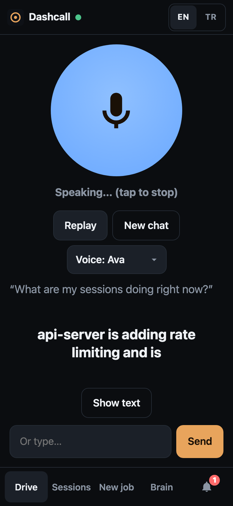
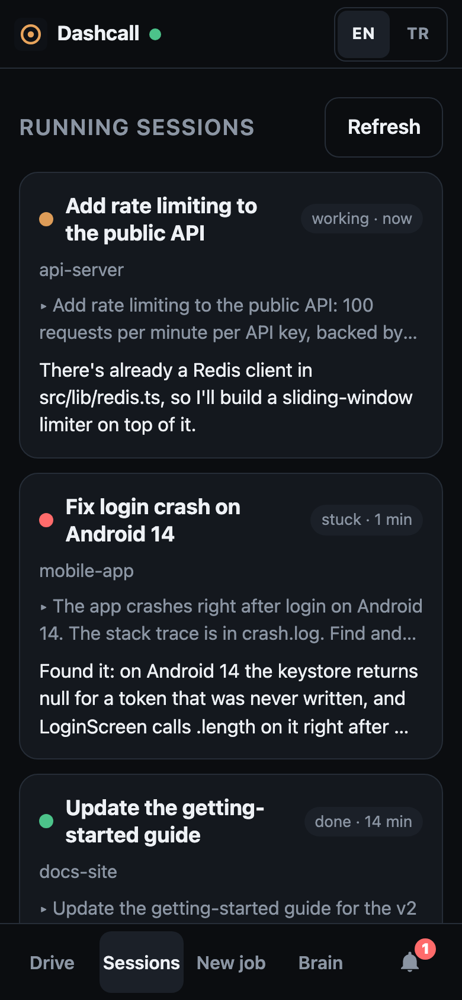
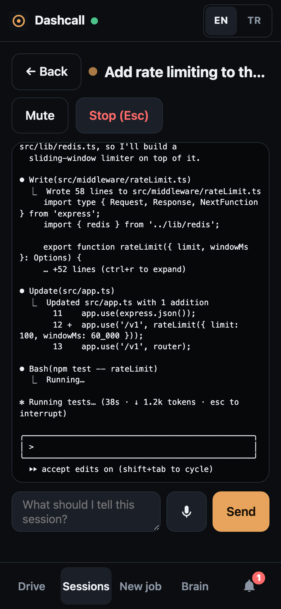
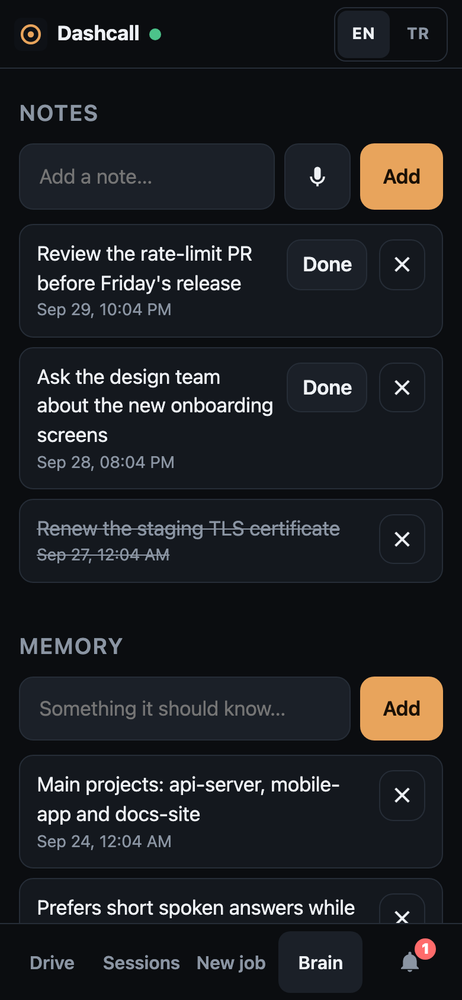
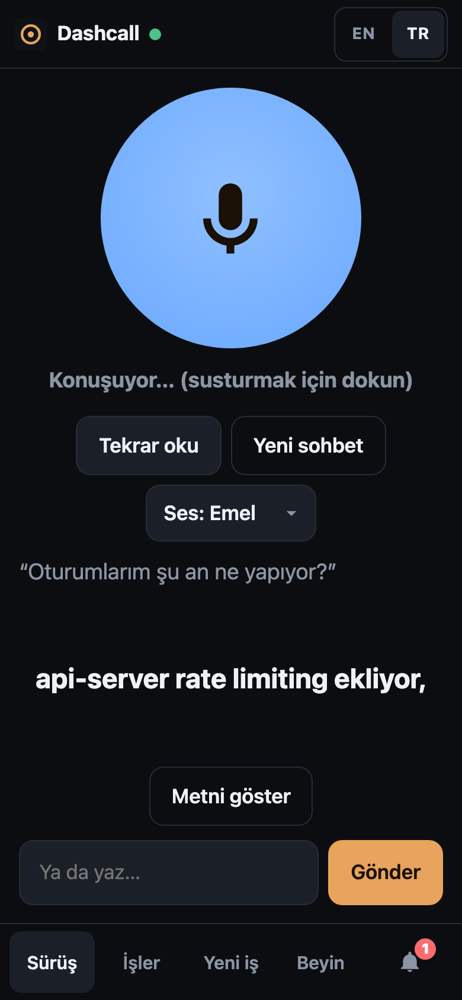
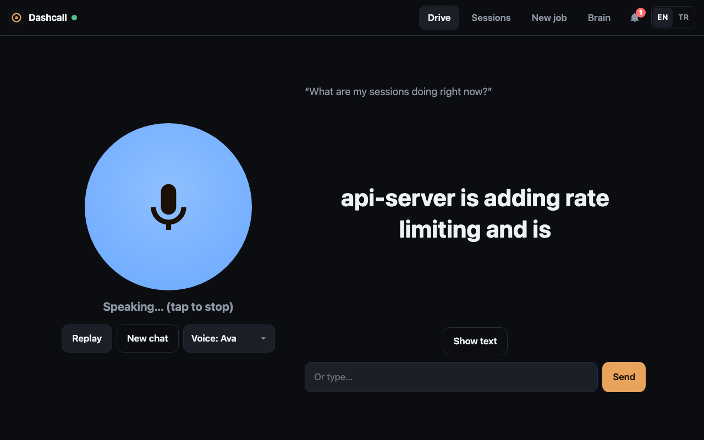

# Dashcall

[Türkçe](README.tr.md)

[](https://github.com/emiralpayar/dashcall/actions/workflows/ci.yml)
[](LICENSE)
[](https://nodejs.org)
[](docs/INSTALL.md)

**Talk to your Claude Code sessions from your phone or your car's browser.**

Your Claude Code sessions keep working on your Mac while you're away from it. Dashcall lets you check on them and
direct them by voice or touch. Ask "what's the status of my jobs?" and hear a short spoken summary. Tell a session
to continue, stop one that went off track, or start a new job in any project folder. Say "research this and let me
know" and close the app: when the work is done, a spoken summary shows up as a notification.

**What you need:** a Mac running your Claude Code sessions inside [herdr](https://herdr.dev) (a terminal workspace
manager for AI coding agents, which lets Dashcall list, read and prompt them), a small Linux server with Docker for
the web app, and [Tailscale](https://tailscale.com) to connect the two. Each spoken question runs a short
`claude -p` call on your Mac, so it uses your own Claude plan. Just curious? The [demo](#try-the-demo-in-30-seconds)
runs anywhere with Node.js.

## Screenshots

<table>
  <tr>
    <td align="center" valign="top" width="33%">
      
      <br><sub><b>Drive.</b> Tap, talk, hear a short answer with live subtitles.</sub>
    </td>
    <td align="center" valign="top" width="33%">
      
      <br><sub><b>Sessions.</b> Every running session at a glance: working, stuck or done.</sub>
    </td>
    <td align="center" valign="top" width="33%">
      
      <br><sub><b>One session.</b> Its live terminal; send a prompt or press Esc.</sub>
    </td>
  </tr>
  <tr>
    <td align="center" valign="top">
      
      <br><sub><b>Brain.</b> Notes, reminders, memory and muted sessions.</sub>
    </td>
    <td align="center" valign="top">
      
      <br><sub><b>Türkçe.</b> The whole app, speech and voice in Turkish.</sub>
    </td>
    <td align="center" valign="middle">
      <sub>On phones the tabs sit in a bottom bar, within thumb reach. On a laptop or a car's wide screen, Drive mode
      puts the button and the subtitles side by side:</sub>
    </td>
  </tr>
</table>

<p align="center">
  
</p>

## Try the demo in 30 seconds

No Mac, Claude Code or herdr needed, only Node.js 22 or newer:

```sh
git clone https://github.com/emiralpayar/dashcall.git && cd dashcall && npm run demo
```

Open <http://localhost:8080> and log in with the password `demo`. The demo runs the real web app against a mock agent
with fake sessions, notes and notifications. Questions get canned answers, shown as timed subtitles. The demo is
silent by default; run `DASHCALL_DEMO_SOUND=1 npm run demo` to hear answers in your browser's built-in voice.

## Features

- **Drive mode.** One big talk button. You speak, a Claude "dispatcher" works out what you mean, acts on your
  sessions, and reads a short answer aloud with synced subtitles. Recording stops after a pause, and you can type
  instead.
- **Sessions.** See every running Claude Code session and the last 48 hours of finished ones. Read a session's
  terminal, send it a prompt, or press Esc to interrupt it.
- **New job.** Pick a project folder, describe the task (by voice or text), and Dashcall starts a new Claude Code
  session for it.
- **Background tasks.** "Look into X and tell me when you're done." The dispatcher starts or watches a session and
  sends you a spoken summary when it finishes, gets stuck, or closes.
- **Notifications.** Every answer and background result is kept, so nothing is lost if you closed the app while
  driving. Each one is read aloud in the language it was written in.
- **Brain.** Persistent memory, notes and reminders, and muted sessions, all managed by voice or in the app.
- **English and Turkish.** Switch the language in the app. Speech recognition, voices and the dispatcher's replies
  follow it.
- **Made for phones.** On a phone the tabs sit in a bottom bar within thumb reach; on a wide screen, Drive mode puts
  the button and subtitles side by side.
- **Small footprint.** Two Node.js servers with no npm dependencies, plus local speech-to-text with whisper.cpp.

## How it works

```
 phone / car browser
        │  HTTPS
        ▼
 web/  (Node, Docker, any Linux server)
        │  password login, serves the app, proxies /api/* with a bearer token
        │  private network, e.g. Tailscale
        ▼
 agent/  (Node, on your Mac)
        ├── herdr ──────────────▶ your interactive Claude Code sessions
        ├── claude -p ──────────▶ dispatcher (dispatcher/CLAUDE.md + `dashcall` CLI)
        ├── ffmpeg + whisper.cpp   speech → text
        └── edge-tts / macOS say   text → speech
```

- **`agent/`** runs on the Mac that hosts your sessions. It uses [herdr](https://herdr.dev) to list, read and
  prompt terminal panes, and reads session transcripts from `~/.claude/projects`.
- **The dispatcher** is a headless `claude -p` run for each question, resumed per conversation. It follows
  [`dispatcher/CLAUDE.md`](dispatcher/CLAUDE.md) and acts on sessions only through the
  [`dashcall` CLI](docs/CLI.md).
- **`web/`** serves the single-page app, handles login and forwards API calls to the agent.

See [docs/ARCHITECTURE.md](docs/ARCHITECTURE.md) for the full picture.

## Quick start

You need a Mac (for the agent) and any Linux server with Docker (for the web app). They can reach each other over
Tailscale. On the Mac, [Claude Code](https://code.claude.com/docs/en/setup) and [herdr](https://herdr.dev) must be
installed, and your Claude Code sessions must run inside herdr. The short version:

```sh
# on the Mac
brew install node ffmpeg whisper-cpp      # Node.js 22 or newer
git clone https://github.com/emiralpayar/dashcall.git && cd dashcall
./scripts/download-model.sh
cp .env.example .env        # set DASHCALL_TOKEN and DASHCALL_BIND
npm run agent

# on the server
git clone https://github.com/emiralpayar/dashcall.git && cd dashcall/web
cp .env.example .env        # set password, secret, agent URL and token
docker compose up -d --build
```

The step-by-step guide covers Claude Code, herdr, Tailscale, HTTPS, running the agent at login, and checking that
everything works: **[docs/INSTALL.md](docs/INSTALL.md)**.

## Languages

Dashcall speaks **English** and **Turkish**. Use the EN/TR switch in the app header or on the login page. The
choice applies to:

- the interface
- speech-to-text (whisper runs in the selected language)
- the neural voices: Ava or Andrew for English, Emel or Ahmet for Turkish, or your Mac's own voice
- the dispatcher's replies

The first visit follows your browser's language. Adding a language is a well-scoped contribution; see
[AGENTS.md](AGENTS.md).

## Security

**Read this before deploying.** Anyone who gets past the login can run arbitrary commands on your Mac through Claude
Code. The password is the whole perimeter.

- The dispatcher runs with `--dangerously-skip-permissions` so it can use the `dashcall` CLI unattended. Text it reads
  (session output, research results, a misheard transcript) can contain prompt injections.
- Keep the agent on a private network (Tailscale) and never expose it publicly. Every request needs the bearer token.
- The web app has a rate-limited password login with optional two-factor codes (`DASHCALL_TOTP_SECRET`), signed
  HttpOnly cookies that expire after 30 days without use, same-origin checks on API writes and a strict Content
  Security Policy. Serve it over HTTPS only.
- New sessions can only start under `DASHCALL_WORKSPACE_ROOT`, which defaults to your home directory.

Details are in [SECURITY.md](SECURITY.md). Please report vulnerabilities privately, as described there.

## Documentation

| Document | What's in it |
| --- | --- |
| [docs/INSTALL.md](docs/INSTALL.md) | Installation from zero, running at login, HTTPS, updating, uninstalling |
| [docs/CONFIGURATION.md](docs/CONFIGURATION.md) | Every environment variable |
| [docs/ARCHITECTURE.md](docs/ARCHITECTURE.md) | Components, request flows, data files and privacy |
| [docs/API.md](docs/API.md) | Agent and web HTTP endpoints, error codes |
| [docs/CLI.md](docs/CLI.md) | The `dashcall` CLI and the brain |
| [docs/TROUBLESHOOTING.md](docs/TROUBLESHOOTING.md) | Common problems and fixes |
| [AGENTS.md](AGENTS.md) | Guide for contributors and AI coding agents |
| [CHANGELOG.md](CHANGELOG.md) | Release notes |

## Contributing

Issues and pull requests are welcome. `npm run demo` is all you need for UI work, and `npm test` runs the test suite
with no dependencies. Tests and demo are silent: automation must never make sound on your machine (see
[AGENTS.md](AGENTS.md#safety-rules)). Start with [CONTRIBUTING.md](CONTRIBUTING.md) and [AGENTS.md](AGENTS.md). This project follows
a [Code of Conduct](CODE_OF_CONDUCT.md).

## License

[MIT](LICENSE). Dashcall runs these tools as separate programs, and each has its own license: Claude Code, herdr,
ffmpeg, whisper.cpp and its model (MIT), and edge-tts (LGPL-3.0). edge-tts uses Microsoft Edge's online text-to-speech
service, which is not an official public API.

Dashcall is an independent project and is not affiliated with Anthropic.
